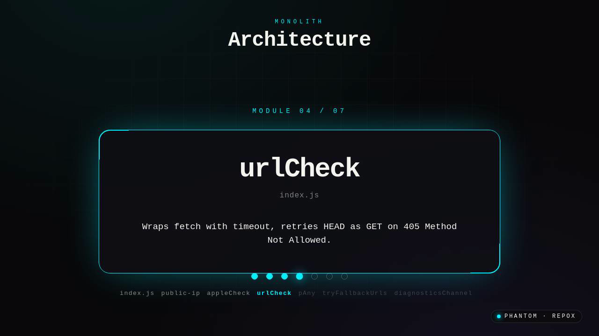
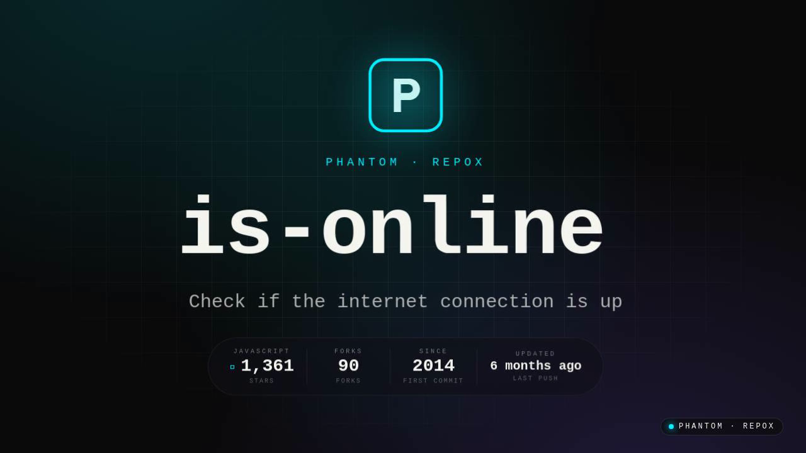
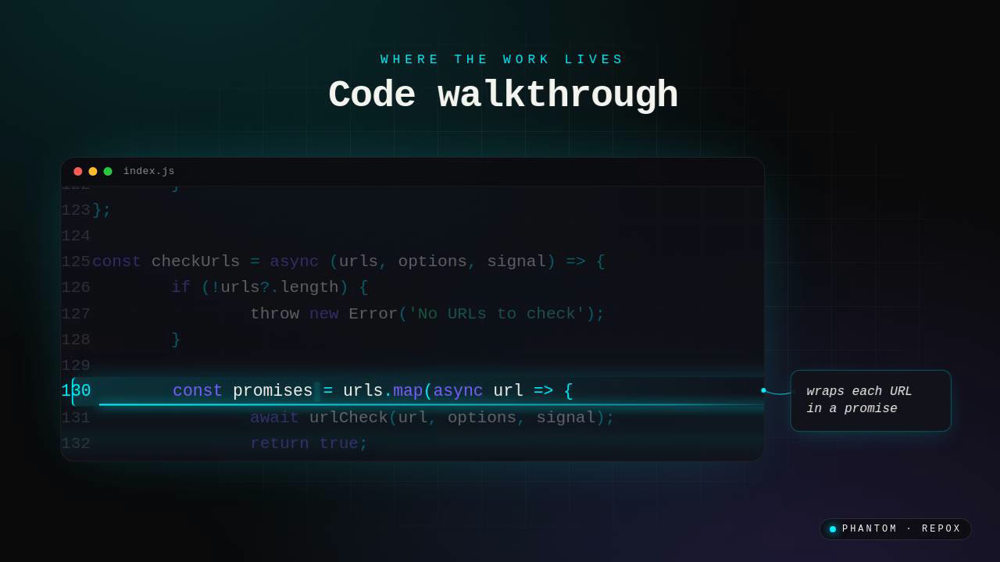

<div align="center">

# Phantom

**Drop a GitHub URL. Get a narrated video walkthrough of the codebase.**




*Frame from a generated walkthrough of `sindresorhus/is-online`. Six more
modules reveal in sync with the narration — the spoken word and the slide
land on the same frame.*

</div>

---

## What this is

Phantom is a personal project: an AI pipeline that turns any public GitHub repo into a 2–4 minute narrated video walkthrough. Paste a URL, get back a video that explains the codebase — architecture, key files, the design decisions a README won't tell you.

It runs locally via Docker Compose. There's no hosted version, no plans, no quotas — you bring your own Anthropic + ElevenLabs (or OpenAI) keys and it generates videos for free.

The point isn't the product. The point is the pipeline: how do you take a directory of source files and reliably turn it into something a senior engineer would actually want to watch?

> 🛠 **Want the technical deep-dive?** [`docs/BUILDING.md`](docs/BUILDING.md) covers the word-level sync algorithm, the stop-slop revision loop, the schema-patch-instead-of-Alembic strategy, the intake classifier, and the bugs that took longer than they should have.

### A few frames from a real render

| Intro card | Architecture (module 4 of 7) | Code walkthrough (line 130 highlighted) |
|---|---|---|
|  |  |  |

---

## How it works

```
┌──────────────────┐   POST /generate    ┌──────────────────┐
│  Next.js (web)   │ ──────────────────▶ │  FastAPI (API)   │
│  Landing + UX    │ ◀────── polling ──── │  Job + status    │
└──────────────────┘                      └────────┬─────────┘
        ▲                                          │ Celery task
        │ /media/videos/...                        ▼
        │                                ┌──────────────────┐
        │                                │  Celery worker   │
        │                                │  Analyzer → Claude
        │                                │   → TTS → Remotion
        │                                │   → ffmpeg fallback│
        │                                └────────┬─────────┘
        │                                          │
        └────────  static MP4 + thumb  ◀───── /app/output ───┘
```

The six pipeline stages:

1. **Clone & analyze** — shallow-clone the repo, walk the tree, extract language stats, entry points, config files, key files, monorepo layout, quality signals (bus factor, activity, security scan).
2. **Script** — pipe the analysis to Claude Sonnet 4.5 with a strict JSON schema. Get back a narration script broken into typed scenes (intro / architecture / code walkthrough / summary).
3. **Diagram** — render an SVG architecture diagram from the extracted modules.
4. **Voice** — synthesize per-section voiceover via ElevenLabs `with-timestamps` (preferred) or OpenAI TTS-1-HD (fallback). The timestamp data is what makes the visual sync tight.
5. **Render** — Remotion composes the scenes from React components. ffmpeg slideshow as a graceful-degradation path.
6. **Finalize** — write the MP4, extract a thumbnail, mark the job complete. Fire user webhook if configured.

The frontend polls `/api/v1/status/{id}` every 1.5s and shows a live terminal feed of what the worker is doing.

---

## Stack

| Layer | Tech |
|---|---|
| **Frontend** | Next.js 14 App Router, TypeScript, Tailwind, Framer Motion, NextAuth (GitHub OAuth) |
| **Backend** | FastAPI, SQLAlchemy 2, Pydantic, Celery, Postgres, Redis |
| **AI** | Anthropic Claude Sonnet 4.5 (script) + Haiku 4.5 (moderation, summaries, Twitter threads) |
| **Voice** | ElevenLabs (preferred, returns word-level alignment), OpenAI TTS (fallback) |
| **Video** | Remotion 4, ffmpeg muxing |
| **Infra** | Docker Compose. Optional Cloudflare R2 + Sentry + PostHog + Resend, all silent without env vars |

---

## Run it locally

Requires Docker Desktop. You'll also want:

- An [Anthropic API key](https://console.anthropic.com) — required, no fallback for the script
- An [ElevenLabs API key](https://elevenlabs.io) — recommended; without it you'll fall back to OpenAI TTS, which is fine but loses the per-word alignment that drives visual sync
- A [GitHub OAuth app](https://github.com/settings/developers) — required if you want sign-in. The callback URL should be `http://localhost:3000/api/auth/callback/github`

Setup:

```bash
git clone https://github.com/vineetsista/Phantom-Codebase-Explainer
cd Phantom-Codebase-Explainer
cp .env.example .env   # then fill in the keys
docker-compose up --build
```

First boot takes a few minutes (Remotion deps + Next compile). Once you see `Application startup complete` from the backend and `✓ Ready` from the frontend, open `http://localhost:3000` and paste a repo URL.

A first render of a small repo like `sindresorhus/is-online` takes ~8–15 minutes end-to-end. The Remotion render step is CPU-bound and dominates the time.

### Required environment variables

The minimal `.env`:

```
ANTHROPIC_API_KEY=sk-ant-...
ELEVENLABS_API_KEY=sk_...        # or OPENAI_API_KEY for TTS fallback

# NextAuth + GitHub OAuth (for sign-in)
NEXTAUTH_URL=http://localhost:3000
NEXTAUTH_SECRET=<openssl rand -base64 32>
GITHUB_CLIENT_ID=<from your OAuth app>
GITHUB_CLIENT_SECRET=<from your OAuth app>

# Defaults from docker-compose — don't change unless you know why
DATABASE_URL=postgresql://phantom:phantom@db:5432/phantom
REDIS_URL=redis://redis:6379/0
```

Optional:

```
GITHUB_TOKEN=ghp_...             # 5000 req/hr instead of 60
SENTRY_DSN=...                   # backend error tracking
NEXT_PUBLIC_SENTRY_DSN=...       # browser error tracking
NEXT_PUBLIC_POSTHOG_KEY=...      # product analytics, EU region by default
RESEND_API_KEY=...               # transactional emails (welcome, generation-complete)
R2_ACCOUNT_ID=...                # Cloudflare R2 — only needed if you want CDN delivery
R2_ACCESS_KEY_ID=...             # instead of local /media/videos serving
R2_SECRET_ACCESS_KEY=...
R2_BUCKET=...
R2_PUBLIC_URL_BASE=https://cdn.example.com/
```

Everything optional is a no-op when its key is missing — nothing crashes.

---

## What you can do

- **Paste a repo URL** at `/` or `/generate` — gets you a full walkthrough video
- **Paste a commit URL** — narrated diff explanation focused on what changed and why
- **Paste a file URL** (`/blob/main/src/foo.ts`) — file-centric walkthrough
- **Paste a PR URL** — code-review-style narration of the diff
- **Paste a gist URL** — snippet explainer
- **Compare two repos** at `/compare` — side-by-side analysis with a "which would I reach for" close

Other surfaces:

- `/showcase` — curated grid; clicking a card lands on a real generated video or a "be the first to generate this" CTA
- `/search?q=...` — full-text search across generated videos
- `/trending` — Redis-backed 24-hour view counter
- `/dashboard` — your own videos, analytics, favorites, comments, API keys, webhook config
- `/v/{id}` — the video player page with chapters, summary tab, share dialog

---

## API

The same surfaces are available over HTTP. Authenticate with an API key (issuable at `/dashboard/api-keys`) via the `X-Phantom-Key` header, or as a signed-in user via the Next.js proxy.

```http
POST   /api/v1/generate          { repo_url, options? } → { job_id, status }
POST   /api/v1/generate/compare  { repo_url_a, repo_url_b }
GET    /api/v1/status/{job_id}                          → { status, progress, details, video_url? }
GET    /api/v1/videos                                   → { videos: [...] }
GET    /api/v1/videos/{id}                              → { video: {...} }
GET    /api/v1/search?q=...                             → { query, videos }
GET    /api/v1/trending                                 → { videos, source }
GET    /api/v1/repo/{owner}/{name}                      → all completed videos for a repo
GET    /api/v1/videos/{id}/twitter-thread               → Haiku-generated promo thread
GET    /media/videos/{filename}.mp4                     → static MP4 (range-aware)
```

The intake classifier (`utils/intake.py`) accepts any of these in `repo_url`: plain repo URLs, commit URLs, blob (file) URLs, gists, PR URLs.

---

## Graceful degradation

The pipeline runs end-to-end without paid API keys. Drop into any of these states and the rest still works:

| Component | With key | Without key |
|---|---|---|
| `ANTHROPIC_API_KEY` | Claude writes the script | Deterministic mock script derived from the analysis |
| `ELEVENLABS_API_KEY` | ElevenLabs voice with word-level alignment | Falls back to OpenAI TTS, then silent WAV stubs |
| `OPENAI_API_KEY` | OpenAI TTS narration | Silent WAV stubs of the right duration |
| `GITHUB_TOKEN` | 5000 req/hr | 60 req/hr public limit |
| Remotion install | Animated React video scenes | ffmpeg slideshow of the SVG diagram + audio |
| `R2_*` | CDN delivery from Cloudflare R2 | Local `/media/videos` serving from the backend |
| `SENTRY_DSN` | Error reporting | Silent |
| `RESEND_API_KEY` | Transactional emails | No emails sent |

---

## Repo layout

```
phantom/
├── backend/                # FastAPI + Celery worker
│   ├── main.py             # FastAPI app + range-aware /media handler
│   ├── routers/            # generate, status, videos, users, social, etc.
│   ├── services/           # repo_analyzer, script_generator,
│   │                       # voice_generator, video_assembler,
│   │                       # pr_analyzer, content_moderator
│   ├── workers/            # Celery app + task definition
│   ├── models/             # SQLAlchemy + schema migration loop
│   └── utils/              # github_client, intake, rate_limit, char_budget
├── frontend/               # Next.js 14 + Tailwind + Framer Motion
│   ├── src/app/            # App Router pages (landing, dashboard, video, etc.)
│   ├── src/components/     # landing/, layout/, shared/, video/
│   ├── src/lib/            # auth, analytics, showcase data
│   └── remotion/           # Remotion compositions (separate package)
├── docker-compose.yml      # 5 services: frontend, backend, worker, db, redis
├── docs/                   # Internal dev notes (release notes, audits)
└── README.md               # this file
```

---

## Notable implementation details

A few things I learned the hard way that ended up in the code:

- **Word-level sync.** ElevenLabs's `with-timestamps` endpoint returns per-character alignment. We use that to make architecture module reveals and code highlights fire at the exact frame the narrator speaks the module name or line content. There's also a heuristic layer for fallback timings, gated so it never touches anchored timings.
- **Schema patches at boot.** `init_db()` runs an idempotent list of `ALTER TABLE` statements in `models/database.py` so the DB stays in sync with the model without bringing in Alembic.
- **Content moderation.** A Haiku-powered classifier runs on the README before generation; refuses obvious-abuse repos. Fail-open if Claude is unavailable.
- **Intake URL classifier.** One pure-Python module (`utils/intake.py`) handles repo / commit / file / gist / PR URL detection and produces a structured payload the script generator uses as a "FOCUS" hint.
- **Stop-slop.** The script generator has a multi-pass slop detector that catches AI tells ("delve", "leverage", "Welcome to this video"), runs Claude through up to three revision passes, and ships only when the slop count stops decreasing.
- **Range-aware MP4 serving.** FastAPI doesn't give you `Range` support out of the box — without it, `<video>` scrubbing breaks. The handler in `main.py` parses byte ranges and returns 206 with `Content-Range`.

---

## License

Apache 2.0. Build whatever you want with it.

If you do something interesting, I'd love to see it.
